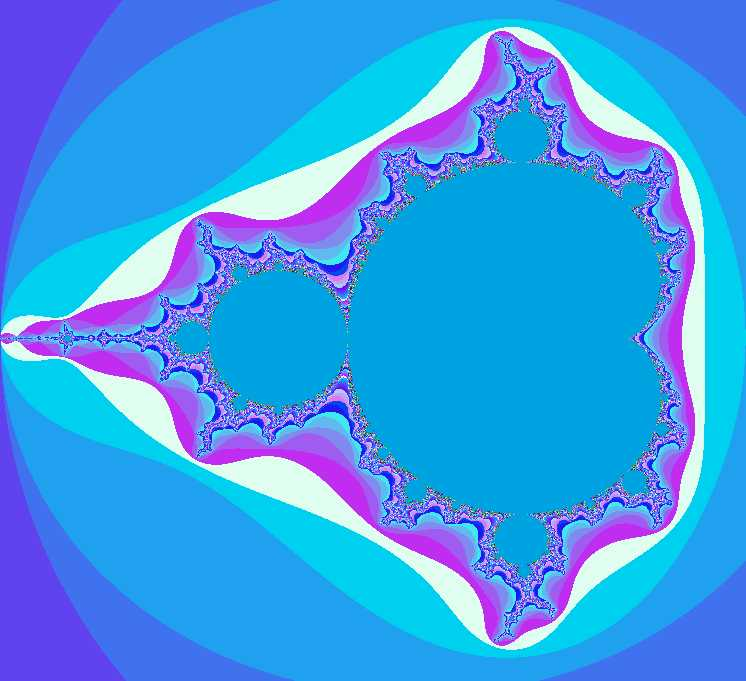



## MandelBrotSet

### Description

This application uses a small amount of API and some judicious use of looping to draw a MandelBrot set inside of a picture box located on a form. The fractal is fully customizable and the sub routine that creates it is almost completely independent. To draw the image just click on the picturebox. To copy the completed image to the clipboard, right-click on the picturebox and select that option from the popup menu.
 
### More Info
 
It would help to know how fractals come to being but that isn't necessary. This application was written in Visual Basic 6.0 with Service Pack 3 installed and that's the only compiler I know it works in. If anybody is interested I might try putting it in VB3, but I won't until somebody asks nicely.

If you maximize the form and start image construction it can take a long time to finish. Maximized at 1024x768 at 24 million colors it took my PC(Intel Celeron 400Mhz with 64Mb) several hours to complete.

             |
---                |---
**Submitted On**   |2000-07-20 12:45:24
**By**             |[KenKnutson](https://github.com/Planet-Source-Code/PSCIndex/blob/master/ByAuthor/kenknutson.md)
**Level**          |Advanced
**User Rating**    |4.6 (23 globes from 5 users)
**Compatibility**  |VB 3\.0, VB 4\.0 \(16\-bit\), VB 4\.0 \(32\-bit\), VB 5\.0, VB 6\.0, VB Script, ASP \(Active Server Pages\) 
**Category**       |[Graphics](https://github.com/Planet-Source-Code/PSCIndex/blob/master/ByCategory/graphics__1-46.md)
**World**          |[Visual Basic](https://github.com/Planet-Source-Code/PSCIndex/blob/master/ByWorld/visual-basic.md)
**Archive File**   |[CODE\_UPLOAD79777202000\.zip](https://github.com/Planet-Source-Code/kenknutson-mandelbrotset__1-9928/archive/master.zip)

